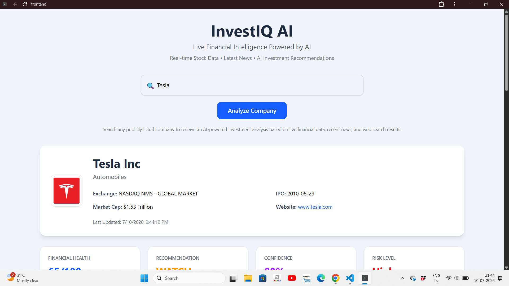
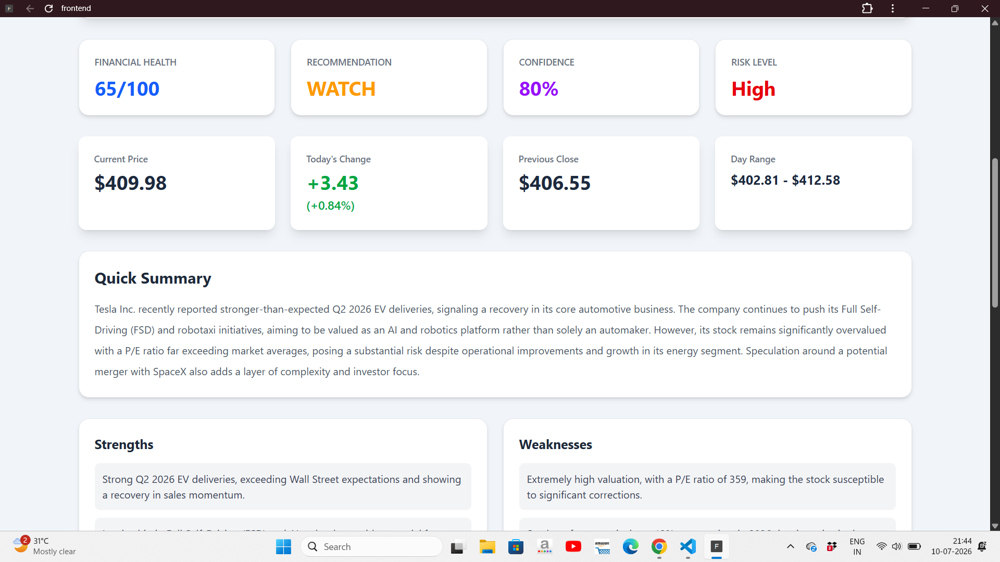

# InvestIQ AI

### AI-Powered Investment Research Platform

InvestIQ AI is a full-stack AI-powered investment research platform designed to help users analyze publicly listed companies using real-time financial data, recent news, web search, and artificial intelligence.

The platform combines live stock market information from Finnhub, web search results from Tavily, and Google's Gemini large language model through LangChain to generate comprehensive investment reports. Users receive AI-generated insights such as financial health analysis, SWOT analysis, confidence score, risk assessment, and BUY/HOLD/SELL recommendations within seconds.

Instead of manually researching multiple financial websites and news sources, InvestIQ AI provides a unified dashboard that simplifies investment research through an intuitive and interactive user experience.


## Live Demo

### Frontend (Vercel)

https://ai-investment-agent-six.vercel.app

### Backend API (Render)

https://ai-investment-agent-7rv9.onrender.com


## Overview

InvestIQ AI was developed to simplify the process of investment research by combining financial market data, company news, web search, and artificial intelligence into a single platform.

Traditionally, investors need to visit multiple websites to collect stock prices, financial news, company information, and market analysis before making an investment decision. This process is time-consuming and often requires comparing information from different sources.

InvestIQ AI addresses this challenge by integrating live financial data from Finnhub, web search results from Tavily, and Google's Gemini AI through LangChain. The platform analyzes this information and generates a comprehensive investment report that includes financial health, SWOT analysis, risk level, confidence score, and BUY/HOLD/SELL recommendations.

The project demonstrates the practical application of Large Language Models (LLMs) in financial analysis while showcasing modern full-stack development using React, Node.js, Express.js, and REST APIs.


## Features

### AI-Powered Analysis

- AI-generated investment reports using Google Gemini
- LangChain-based prompt orchestration
- BUY / HOLD / SELL investment recommendations
- Financial health evaluation
- Risk level assessment
- Confidence score generation
- SWOT (Strengths, Weaknesses, Opportunities, Threats) analysis

### Financial Data

- Live stock market data
- Company profile information
- Market capitalization
- IPO details
- Daily stock price changes
- High, low, opening, and previous closing prices

### Market Intelligence

- Latest company news
- Web search integration using Tavily
- Company-specific investment insights
- Recent market developments

### User Experience

- Search publicly listed companies
- Responsive user interface
- Fast and interactive dashboard
- Clean and intuitive design
- Real-time data visualization

### Backend Features

- RESTful API architecture
- Modular service-based backend
- External API integration
- Error handling and validation
- Environment variable configuration


## System Architecture

InvestIQ AI follows a modular full-stack architecture where the frontend, backend, AI services, and external APIs work together to generate an intelligent investment analysis report.

The workflow begins when a user searches for a publicly listed company from the React-based frontend. The request is sent to the Node.js and Express backend, where the company name is processed to identify the appropriate stock symbol.

The backend then collects live financial information from Finnhub, recent web search results from Tavily, and company-related news. These data sources are combined into a structured prompt using LangChain.

The prompt is sent to Google's Gemini model, which analyzes the financial information and generates an AI-powered investment report containing financial health analysis, SWOT analysis, confidence score, risk assessment, and BUY/HOLD/SELL recommendations.

Finally, the processed response is returned to the React frontend, where it is displayed in a structured dashboard with company information, live stock data, AI insights, and investment recommendations.

### Workflow

```text
                           User
                             │
                             ▼
                  React Frontend (Vite)
                             │
                             ▼
               Node.js + Express Backend
                             │
                             ▼
                Company Symbol Resolution
                             │
        ┌────────────────────┼────────────────────┐
        ▼                    ▼                    ▼
  Finnhub API         Tavily Search         Company News
        │                    │                    │
        └────────────────────┴────────────────────┘
                             │
                             ▼
                 LangChain Prompt Builder
                             │
                             ▼
                    Google Gemini AI
                             │
                             ▼
               AI Investment Analysis
                             │
                             ▼
                 JSON Response Generator
                             │
                             ▼
              React Investment Dashboard
```


## Tech Stack

| Category | Technologies |
|----------|--------------|
| Frontend | React.js, Vite, Tailwind CSS, Axios |
| Backend | Node.js, Express.js |
| AI Framework | LangChain |
| Large Language Model | Google Gemini |
| Financial Data API | Finnhub API |
| Web Search API | Tavily Search API |
| Version Control | Git, GitHub |
| Development Tools | Visual Studio Code, Postman |
| Runtime Environment | Node.js |

### Technology Overview

- **React.js** – Builds a responsive and interactive user interface.
- **Node.js & Express.js** – Provide the backend REST API and application logic.
- **LangChain** – Structures prompts and manages communication with the AI model.
- **Google Gemini** – Generates AI-powered investment analysis and recommendations.
- **Finnhub API** – Supplies live stock market data and company information.
- **Tavily Search API** – Retrieves recent web search results and market insights.
- **Axios** – Handles communication between the frontend, backend, and external APIs.
- **Tailwind CSS** – Provides a modern, responsive, and utility-first UI design.


## Project Structure

```text
InvestIQ AI
│
├── backend
│   ├── src
│   │   ├── config
│   │   ├── controllers
│   │   ├── prompts
│   │   ├── routes
│   │   ├── services
│   │   ├── server.js
│   │   └── app.js
│   │
│   ├── package.json
│   └── .env
│
├── frontend
│   ├── src
│   │   ├── components
│   │   ├── services
│   │   ├── App.jsx
│   │   └── main.jsx
│   │
│   ├── public
│   ├── package.json
│   └── vite.config.js
│
├── .gitignore
└── README.md
```

### Backend

| Folder | Description |
|---------|-------------|
| `config` | Configuration files for LangChain and application settings |
| `controllers` | Handles incoming API requests and responses |
| `prompts` | Stores AI prompt templates used by Gemini |
| `routes` | Defines REST API endpoints |
| `services` | Contains business logic, AI processing, Finnhub integration, and Tavily search |
| `server.js` | Starts the Express server |
| `app.js` | Configures Express middleware and routes |

### Frontend

| Folder | Description |
|---------|-------------|
| `components` | Reusable React UI components |
| `services` | Axios API communication layer |
| `App.jsx` | Main application component |
| `main.jsx` | React application entry point |
| `public` | Static assets |

### Root Files

| File | Description |
|------|-------------|
| `.gitignore` | Excludes unnecessary files such as `node_modules` and `.env` |
| `README.md` | Project documentation |


## Installation & Setup

### Prerequisites

Before running the project, ensure the following software is installed on your system:

- Node.js (v18 or later)
- npm (Node Package Manager)
- Git
- Visual Studio Code (Recommended)

### Clone the Repository

```bash
git clone https://github.com/urwashi-kumari/AI-Investment_Agent.git
```

```bash
cd AI-Investment_Agent
```

---

### Backend Setup

Navigate to the backend directory:

```bash
cd backend
```

Install dependencies:

```bash
npm install
```

Create a `.env` file inside the `backend` directory and configure the required environment variables.

Start the backend server:

```bash
npm run dev
```

The backend server will start at:

```text
http://localhost:5000
```

---

### Frontend Setup

Open a new terminal and navigate to the frontend directory:

```bash
cd frontend
```

Install dependencies:

```bash
npm install
```

Start the React development server:

```bash
npm run dev
```

The frontend application will start at:

```text
http://localhost:5173
```

---

### Running the Application

1. Start the backend server.
2. Start the frontend server.
3. Open the frontend URL in your browser.
4. Search for a publicly listed company (e.g., Tesla, Microsoft, Apple, Amazon).
5. View the AI-generated investment report.


## Environment Variables

Create a `.env` file inside the **backend** directory and configure the following environment variables:

```env
# Server Configuration
PORT=5000

# Google Gemini API Key
GEMINI_API_KEY=your_gemini_api_key

# Finnhub API Key
FINNHUB_API_KEY=your_finnhub_api_key

# Tavily Search API Key
TAVILY_API_KEY=your_tavily_api_key
```

### Environment Variable Description

| Variable | Description |
|----------|-------------|
| `PORT` | Port number on which the backend server runs |
| `GEMINI_API_KEY` | API key used to access Google's Gemini AI model |
| `FINNHUB_API_KEY` | API key used to fetch live financial market data |
| `TAVILY_API_KEY` | API key used to perform real-time web searches |

> **Note:** Never commit your `.env` file or API keys to GitHub. The `.gitignore` file excludes sensitive configuration files from version control.

## API Workflow

InvestIQ AI follows a multi-stage workflow to generate AI-powered investment reports.

### Step 1: User Search

The user enters the name of a publicly listed company through the React frontend.

Example:

```text
Microsoft
```

---

### Step 2: Backend Request

The frontend sends a POST request to the Express backend.

```http
POST /analyze
```

The backend receives the company name and automatically identifies the appropriate stock symbol.

---

### Step 3: Data Collection

The backend collects information from multiple external services.

| Service | Purpose |
|---------|---------|
| Finnhub API | Fetches live stock prices, company profile, and market information |
| Tavily Search API | Retrieves recent web search results and company-related information |
| Google Gemini | Generates AI-powered investment analysis |

---

### Step 4: AI Processing

LangChain combines the collected information into a structured prompt and sends it to Google's Gemini model.

Gemini analyzes the data and generates:

- Financial Health Score
- Investment Recommendation
- Risk Level
- Confidence Score
- SWOT Analysis
- Investment Summary

---

### Step 5: Response Generation

The backend converts the AI response into structured JSON format and returns it to the frontend.

---

### Step 6: Dashboard

The React application displays:

- Company Profile
- Live Stock Information
- Financial Health Score
- Recommendation
- Confidence Score
- Risk Level
- AI Summary
- SWOT Analysis


## Future Improvements

The following enhancements can be added in future releases:

- User authentication and authorization
- Personalized investment watchlists
- Portfolio management dashboard
- Interactive stock price charts
- Historical stock trend analysis
- AI-powered news sentiment analysis
- PDF report generation
- Email notifications for major market events
- Multi-language support
- Cloud deployment with CI/CD pipeline


## Screenshots

### Home Page

> Add a screenshot of the landing page here.


---

### Investment Dashboard

> Add a screenshot showing the AI-generated investment report.



---

### Company Profile

> Add a screenshot displaying the company profile and live stock information.


## Author

**Urwashi Kumari**

Computer Science and Engineering Student

GitHub: https://github.com/urwashi-kumari

LinkedIn:https://www.linkedin.com/in/urwashikumari17/


## License
## License

This project is licensed under the MIT License.

For more information, see the LICENSE file.